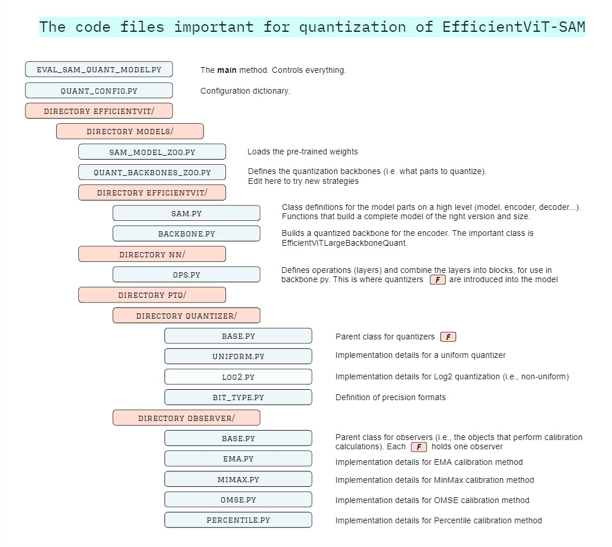
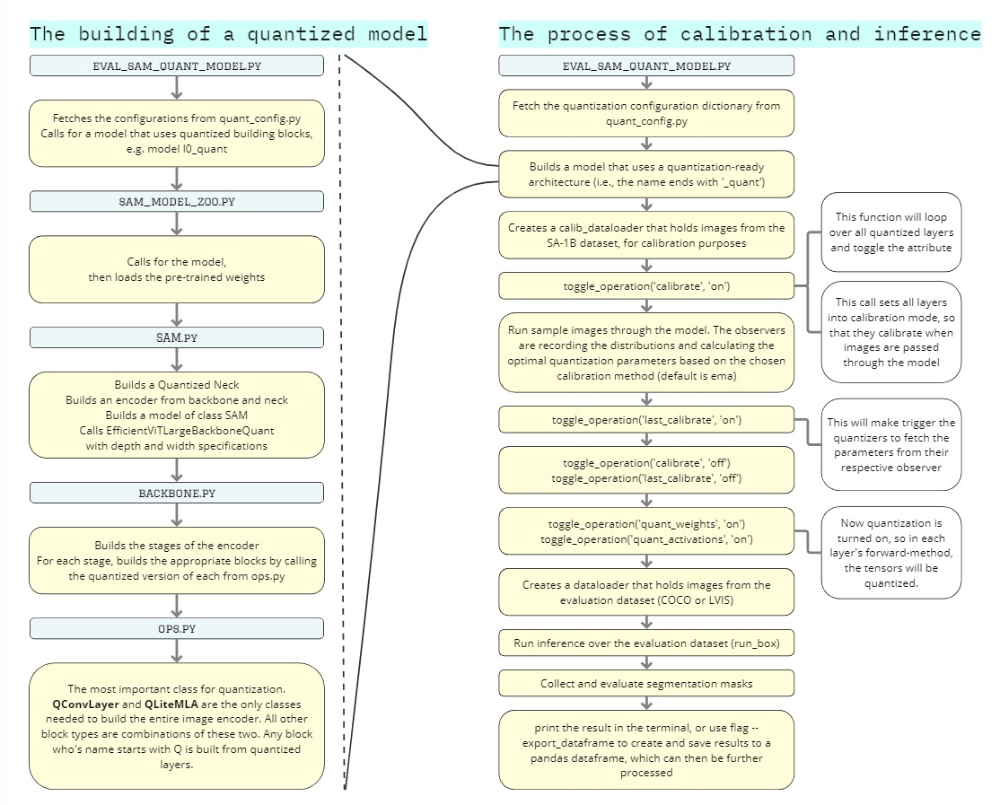

# Simulated Quantization of EfficientViT-SAM

## Quantized models

__LEFT__: Accuracy vs size trade-off. Accuracy is measured in simulation, the size of the model refers to the size of the weights only, under the given mixed-precision scheme (FP16/INT8). Only L-series included, since accuracy drops severly for the XL-Series.

__RIGHT__: Accuracy vs latency trade-off. Here, accuracy is measured in deployment using TensorRT. This highlights that __the simulation framework fails to approximate the accuracy results in deployment!__.

<div style="display: flex; justify-content: space-around;">
    <div>
        <p align="left">
            
        </p>
    </div>
    <div>
        <p align='left'>
            
        </p>
    </div>
</div>

## Pretrained non-quantized models, as compared to the original SAM

Latency/Throughput is measured on NVIDIA Jetson AGX Orin, and NVIDIA A100 GPU with TensorRT, fp16. Data transfer time is included.

<p align="left">

</p>

## Overview
<p align="left">

</p>
<p align="left">

</p>
<p align="left">

</p>

## Datasets

Evaluation on [COCO2017](https://cocodataset.org/#download) and [LVIS annotations](https://www.lvisdataset.org/dataset) is supported.

To conduct box-prompted instance segmentation with detected boxes, you must first obtain the *source_json_file* of those boxes. Follow the instructions of [ViTDet](https://github.com/facebookresearch/detectron2/tree/main/projects/ViTDet), to get the *source_json_file*. You can also download our [pre-generated files](https://huggingface.co/han-cai/efficientvit-sam/tree/main/source_json_file). Our thesis onducted box-prompted instance ssegmentation of the COCO ground truth (measuring mIoU) and the ViTDET boxes (measuring mAP). Below is the expected file structure. Note that train2017 is only needed only for LVIS evaluation, not COCO evaluation. The model is trained and calibrated on SA-1B, so evaluation on COCO train2017 is okay. Resonably, place the entire coco/ directory on a shared server, mount it as a volume to the container, and symlink to it from the container.

Expected directory structure:
```python
coco
├── train2017
├── val2017
├── annotations
│   ├── instances_val2017.json
│   ├── lvis_v1_val.json
|── source_json_file
│   ├── coco_vitdet.json
│   ├── lvis_vitdet.json
```

## Weights
Pre-trained weights can be downloaded at [huggingface](https://huggingface.co/mit-han-lab/efficientvit-sam/tree/main).

Expected directory structure:
```python
assets
├── checkpoints
│   ├── cls
|   |── sam
│       ├── l0.pt
│       ├── l1.pt
│       ├── l2.pt
│       ├── xl0.pt
│       ├── xl1.pt
```

## Usage

### main workflow
```python
# file: eval_sam_quant_model.py
# model creation 
from efficientvit.sam_model_zoo import create_sam_model
from quant_config import Config

quant_config = Config(args)
efficientvit_sam = create_sam_model(
    name="l0_quant", pretrained=True, weight_url="assets/checkpoints/sam/l0.pt", config=quant_config
    )

efficientvit_sam = efficientvit_sam.cuda().eval()

# calibration of quantization operators
calib_dataloader = DataLoader(calib_dataset, ...)
calibrate_image_encoder(efficientvit_sam, calib_dataloader, args, local_rank)

# activate quantization
toggle_operation(efficientvit_sam, 'quant_weights', 'on')
toggle_operation(efficientvit_sam, 'quant_activations', 'on')

# inference and evaluation of quantized model
dataloader = DataLoader(dataset, ...)
results = run_box(efficientvit_sam, dataloader)
evaluate(results, ...)
```

### script: layer-wise sensitivity analysis

```python
# launch layer-wise sensitvity analysis of all model variants
scripts/layer_analysis_script.sh

# expected output:
--------- Layer-wise sensitivity analysis of EfficientViT-SAM L0 ---------

Model l0_quant, backbone_version: L0:stage0:0:0 §
 45%|████████        | 2250/5000
100%|████████████████| 2500/2500

saved 0.00 Mb
New row added to file results/l0_quant.pkl: 
    model backbone_version prompt_type quantize_W quantize_A ... megabytes_saved
0   l0_quant    L0:stage0:0:0         box       True       True  ...       0.000824

Model l0_quant, backbone_version: L0:stage0:1:0 §
...
# [same pattern for all layers of all model variants. This only evaluates ground-truth box-prompt on COCO]
```
### script: Mix-DWSC evaluation

```python
# evaluate quantization scheme Mix-DWSC
# Step 1: Manually enter efficientvit/models/nn/ops.py/class QMBConv and configure:
#        protect_sensitive_input_conv_to_FP32 = False
#        protect_sensitive_depthwise_conv_to_FP32 = True
#        protect_sensitive_pointwise_conv_to_FP32 = True
# Step 2: run script
scripts/benchmark_mix_dwsc.sh

# expected output: 
--------- Benchmarking Mix-DWSC on COCO (remeber to toggle two flags in OPS.py) ---------

90%|███████████████| 4500/5000
100%|█████████████████| 2500/2500

all=75.757, large=80.210, medium=77.989, small=71.337
saved 18.55 Mb
box COCO: l0_quant, any:all:all:all §
... #[same pattern for the five model variants]


... #[same pattern for the five model variants]
... #[followed by the same evaluation of detected box-prompts on both COCO and LVIS]
```

### script: Mix-MBC-Neck evaluation

```python
# evaluate quantization scheme Mix-MBC-Neck
# Step 1: Manually enter efficientvit/models/nn/ops.py/class QMBConv and configure:
#        protect_sensitive_input_conv_to_FP32 = True
#        protect_sensitive_depthwise_conv_to_FP32 = True
#        protect_sensitive_pointwise_conv_to_FP32 = True
# Step 2: run script
scripts/benchmark_mix_mbc-neck.sh

# expected output on COCO dataset
--------- Benchmarking Mix-MBC-Neck on COCO (remeber to toggle three flags in OPS.py) ---------

90%|███████████████| 4500/5000
100%|█████████████████| 2500/2500

all=76.849, large=81.353, medium=78.972, small=72.489
saved 15.77 Mb
box COCO: l0_quant, any:all_but_neck:all:all §
... #[same pattern for the five model variants]

# expected output on LVIS dataset
90%|███████████████| 4500/5000
100%|█████████████████| 2500/2500

 Average Precision  (AP) @[ IoU=0.50:0.95 | area=   all | maxDets=100 ] = 0.428
 Average Precision  (AP) @[ IoU=0.50      | area=   all | maxDets=100 ] = 0.694
 Average Precision  (AP) @[ IoU=0.75      | area=   all | maxDets=100 ] = 0.444
 Average Precision  (AP) @[ IoU=0.50:0.95 | area= small | maxDets=100 ] = 0.264
 Average Precision  (AP) @[ IoU=0.50:0.95 | area=medium | maxDets=100 ] = 0.468
 Average Precision  (AP) @[ IoU=0.50:0.95 | area= large | maxDets=100 ] = 0.591
 Average Recall     (AR) @[ IoU=0.50:0.95 | area=   all | maxDets=  1 ] = 0.329
 Average Recall     (AR) @[ IoU=0.50:0.95 | area=   all | maxDets= 10 ] = 0.520
 Average Recall     (AR) @[ IoU=0.50:0.95 | area=   all | maxDets=100 ] = 0.542
 Average Recall     (AR) @[ IoU=0.50:0.95 | area= small | maxDets=100 ] = 0.388
 Average Recall     (AR) @[ IoU=0.50:0.95 | area=medium | maxDets=100 ] = 0.591
 Average Recall     (AR) @[ IoU=0.50:0.95 | area= large | maxDets=100 ] = 0.685
saved 15.77 Mb
box_from_detector COCO: l0_quant, any:all_but_neck:all:all §
... #[same pattern for the five model variants]
... #[followed by the same evaluation of detected box-prompts on both COCO and LVIS]

```

### script: Full INT8 evaluation

```python
# evaluate quantization to INT8 of the entire encoder:
# Step 1: make sure that the toggles in efficientvit/models/nn/ops.py/class QMBConv are all False
# Step 2: run script (which is equivalent to the script for mix-dwsc)
scripts/benchmark_int8.sh

# expected output on COCO dataset
--------- Benchmarking Mix-MBC-Neck on COCO (remeber to toggle three flags in OPS.py) ---------

90%|███████████████| 4500/5000
100%|█████████████████| 2500/2500

all=38.578, large=48.167, medium=25.984, small=43.342
saved 29.28 Mb
box COCO: l0_quant, any:all:all:all §
... #[same pattern for the five model variants]

```

### Design your own quantization schemes

There are two main ways to design a quantization scheme.

First, one can enter `ops.py` and manually substitute the quantized layers (`QConvLayer`) to non-quantized versions (`ConvLayer`). One step higher, one can enter `backbone.py` and edit the class `EfficientViTLargeBackboneQuant` by substituting quantized blocks (such as QMBConv) for non-quantized versions (MBConv). Then just benchmark a model using scripts/benchmark_int8.sh.

Second, one can design a custom backbone version in `quant_backbone_zoo.py`, and then use that as `--backbone_version` argument to the main method. The logic is as follows. A dictinary is specified on this format:

```python
# example scheme that applies quantization to point-wise convs in Stage 1 and 2, nothing else.
    backbone_dict['L0:1,2:any:1'] =  {
        'stages': [1,2],
        'block_positions': [],
        'layer_positions': [1],
    }
```
This backbone version will cause _only_ those layers that match all three criterions to be quantized. An empty [] means that _all_ layers will automatically pass this criterion. In this example, the quantization will target layers in stage 1 and 2, at any block position withing the stages. It will hoever only target layer-position 1 in each block. This is equivalent to quantization of the 1x1 point-wise convolutions inside each Fused-MBConv block in those stages. 'L0' here means model L0, but substitute for 'any' to make the same scheme applicable to any model. The scheme will be forwarded to the function `toggle_selective_attribute` in `class EfficientViTSamImageEncoder` in `sam.py`

One can use the dictionaries `REGISTERED_BACKBONE_DESCRIPTIONS` (L/XL) to find out what layer has what position, on the format stage:block:layer.  Indexing is always zero-based.

### Docker
There is a Dockerfile, which uses the base PyTorch image, clones this repo, and pip installs requirements.txt. You will need to collect the datasets and weights as per above. They need to be stored somewhere, and that somewhere needs to be attached as a volume when you create a container from the image that the Dockerfile produces. Then you need to create symlinks to the above wile structure. Here is a command that may help in creating the container from the image:

`docker run --detach --name <name of container> --gpus all -it --ipc=host -v <path to datasets, weights or other assets>:/datasets <name of image`

### TMUX
A great way to run experiments on a remote server

## A word of caution

This simulation framework can be overly optimistic on both accuracy results and size calculations. When building enginens in NVIDIA TensorRT that quantize the same layers (with almost the same configurations), the accuracy results are in dissagreement. In simulation accuracy is substantially higher. Finding the causes of this remains a future work.

As an example, quantizing everything to INT8 gives the following discrepancies when measuring mIoU on COCOval2017


--------- Benchmarking INT8 quantization of everything on COCO (make sure that all flags in ops.py are False) ---------
 
all=38.578, large=48.167, medium=25.984, small=43.342
saved 29.28 Mb
box COCO: l0_quant, any:all:all:all §
 
all=46.843, large=46.215, medium=46.668, small=47.353
saved 41.54 Mb
box COCO: l1_quant, any:all:all:all §
 
all=49.406, large=42.248, medium=50.070, small=53.019
saved 54.57 Mb
box COCO: l2_quant, any:all:all:all §
 
all=34.807, large=26.110, medium=34.973, small=39.722
saved 107.61 Mb
box COCO: xl0_quant, any:all:all:all §

all=24.823, large=4.068, medium=30.220, small=32.451
saved 189.96 Mb
box COCO: xl1_quant, any:all:all:all §

 Average Precision  (AP) @[ IoU=0.50:0.95 | area=   all | maxDets=100 ] = 0.054
 Average Precision  (AP) @[ IoU=0.50      | area=   all | maxDets=100 ] = 0.163
 Average Precision  (AP) @[ IoU=0.75      | area=   all | maxDets=100 ] = 0.028
 Average Precision  (AP) @[ IoU=0.50:0.95 | area= small | maxDets=100 ] = 0.020
 Average Precision  (AP) @[ IoU=0.50:0.95 | area=medium | maxDets=100 ] = 0.027
 Average Precision  (AP) @[ IoU=0.50:0.95 | area= large | maxDets=100 ] = 0.122
 Average Recall     (AR) @[ IoU=0.50:0.95 | area=   all | maxDets=  1 ] = 0.083
 Average Recall     (AR) @[ IoU=0.50:0.95 | area=   all | maxDets= 10 ] = 0.123
 Average Recall     (AR) @[ IoU=0.50:0.95 | area=   all | maxDets=100 ] = 0.128
 Average Recall     (AR) @[ IoU=0.50:0.95 | area= small | maxDets=100 ] = 0.100
 Average Recall     (AR) @[ IoU=0.50:0.95 | area=medium | maxDets=100 ] = 0.071
 Average Recall     (AR) @[ IoU=0.50:0.95 | area= large | maxDets=100 ] = 0.191
saved 29.28 Mb
box_from_detector COCO: l0_quant, any:all:all:all §

 Average Precision  (AP) @[ IoU=0.50:0.95 | area=   all | maxDets=100 ] = 0.055
 Average Precision  (AP) @[ IoU=0.50      | area=   all | maxDets=100 ] = 0.223
 Average Precision  (AP) @[ IoU=0.75      | area=   all | maxDets=100 ] = 0.008
 Average Precision  (AP) @[ IoU=0.50:0.95 | area= small | maxDets=100 ] = 0.045
 Average Precision  (AP) @[ IoU=0.50:0.95 | area=medium | maxDets=100 ] = 0.057
 Average Precision  (AP) @[ IoU=0.50:0.95 | area= large | maxDets=100 ] = 0.073
 Average Recall     (AR) @[ IoU=0.50:0.95 | area=   all | maxDets=  1 ] = 0.077
 Average Recall     (AR) @[ IoU=0.50:0.95 | area=   all | maxDets= 10 ] = 0.120
 Average Recall     (AR) @[ IoU=0.50:0.95 | area=   all | maxDets=100 ] = 0.126
 Average Recall     (AR) @[ IoU=0.50:0.95 | area= small | maxDets=100 ] = 0.106
 Average Recall     (AR) @[ IoU=0.50:0.95 | area=medium | maxDets=100 ] = 0.130
 Average Recall     (AR) @[ IoU=0.50:0.95 | area= large | maxDets=100 ] = 0.138
saved 41.54 Mb
box_from_detector COCO: l1_quant, any:all:all:all §

 Average Precision  (AP) @[ IoU=0.50:0.95 | area=   all | maxDets=100 ] = 0.053
 Average Precision  (AP) @[ IoU=0.50      | area=   all | maxDets=100 ] = 0.205
 Average Precision  (AP) @[ IoU=0.75      | area=   all | maxDets=100 ] = 0.011
 Average Precision  (AP) @[ IoU=0.50:0.95 | area= small | maxDets=100 ] = 0.071
 Average Precision  (AP) @[ IoU=0.50:0.95 | area=medium | maxDets=100 ] = 0.077
 Average Precision  (AP) @[ IoU=0.50:0.95 | area= large | maxDets=100 ] = 0.036
 Average Recall     (AR) @[ IoU=0.50:0.95 | area=   all | maxDets=  1 ] = 0.073
 Average Recall     (AR) @[ IoU=0.50:0.95 | area=   all | maxDets= 10 ] = 0.131
 Average Recall     (AR) @[ IoU=0.50:0.95 | area=   all | maxDets=100 ] = 0.139
 Average Recall     (AR) @[ IoU=0.50:0.95 | area= small | maxDets=100 ] = 0.155
 Average Recall     (AR) @[ IoU=0.50:0.95 | area=medium | maxDets=100 ] = 0.172
 Average Recall     (AR) @[ IoU=0.50:0.95 | area= large | maxDets=100 ] = 0.085
saved 54.57 Mb
box_from_detector COCO: l2_quant, any:all:all:all §
 

 Average Precision  (AP) @[ IoU=0.50:0.95 | area=   all | maxDets=100 ] = 0.005
 Average Precision  (AP) @[ IoU=0.50      | area=   all | maxDets=100 ] = 0.030
 Average Precision  (AP) @[ IoU=0.75      | area=   all | maxDets=100 ] = 0.000
 Average Precision  (AP) @[ IoU=0.50:0.95 | area= small | maxDets=100 ] = 0.010
 Average Precision  (AP) @[ IoU=0.50:0.95 | area=medium | maxDets=100 ] = 0.006
 Average Precision  (AP) @[ IoU=0.50:0.95 | area= large | maxDets=100 ] = 0.004
 Average Recall     (AR) @[ IoU=0.50:0.95 | area=   all | maxDets=  1 ] = 0.014
 Average Recall     (AR) @[ IoU=0.50:0.95 | area=   all | maxDets= 10 ] = 0.026
 Average Recall     (AR) @[ IoU=0.50:0.95 | area=   all | maxDets=100 ] = 0.028
 Average Recall     (AR) @[ IoU=0.50:0.95 | area= small | maxDets=100 ] = 0.045
 Average Recall     (AR) @[ IoU=0.50:0.95 | area=medium | maxDets=100 ] = 0.029
 Average Recall     (AR) @[ IoU=0.50:0.95 | area= large | maxDets=100 ] = 0.010
saved 107.61 Mb
box_from_detector COCO: xl0_quant, any:all:all:all §

 Average Precision  (AP) @[ IoU=0.50:0.95 | area=   all | maxDets=100 ] = 0.004
 Average Precision  (AP) @[ IoU=0.50      | area=   all | maxDets=100 ] = 0.022
 Average Precision  (AP) @[ IoU=0.75      | area=   all | maxDets=100 ] = 0.000
 Average Precision  (AP) @[ IoU=0.50:0.95 | area= small | maxDets=100 ] = 0.004
 Average Precision  (AP) @[ IoU=0.50:0.95 | area=medium | maxDets=100 ] = 0.009
 Average Precision  (AP) @[ IoU=0.50:0.95 | area= large | maxDets=100 ] = 0.000
 Average Recall     (AR) @[ IoU=0.50:0.95 | area=   all | maxDets=  1 ] = 0.011
 Average Recall     (AR) @[ IoU=0.50:0.95 | area=   all | maxDets= 10 ] = 0.022
 Average Recall     (AR) @[ IoU=0.50:0.95 | area=   all | maxDets=100 ] = 0.023
 Average Recall     (AR) @[ IoU=0.50:0.95 | area= small | maxDets=100 ] = 0.032
 Average Recall     (AR) @[ IoU=0.50:0.95 | area=medium | maxDets=100 ] = 0.039
 Average Recall     (AR) @[ IoU=0.50:0.95 | area= large | maxDets=100 ] = 0.000
saved 189.96 Mb
box_from_detector COCO: xl1_quant, any:all:all:all §

## Troubleshooting
The scripts do export OMP_NUM_THREADS. This value may not be compatible with your hardware.
We never got the package dependencies to work for the evaluation of box-prompt on LVIS with detected boxes from ViTDet, so it is expected that these runs fail.

## Acknowledgements

This simulation framework is heavily inspiered by [FQ-ViT by megvii-research](https://github.com/megvii-research/FQ-ViT). If you find this repo usefull in your research, please also acknowledge their work by citing their paper:
```
@inproceedings{lin2022fqvit,
  title={FQ-ViT: Post-Training Quantization for Fully Quantized Vision Transformer},
  author={Lin, Yang and Zhang, Tianyu and Sun, Peiqin and Li, Zheng and Zhou, Shuchang},
  booktitle={Proceedings of the Thirty-First International Joint Conference on Artificial Intelligence, {IJCAI-22}},
  pages={1173--1179},
  year={2022}
}
```

## Future work

From this project, we found that:

- Mixed-precision post-training quantization (PTQ) to INT8 is not a feasible method of accelerating EfficientViT-SAM, due to severe accuracy degradation. At least not when limited to the uniform case (i.e., not deploying special methods or re-paramterization tricks).
- The sensitivity in EfficientViT-Large is concentrated to the Mobile Inverted Convolution block (MBC), often due to the Depth-wise Separable Convolution (DWSC) inside of it. Be cautios of this block type in quantizaiton.
- The ReLU Linear Attention layers appear to be robust under quantization

We therefore urge future work into:

- Quantization-Aware training (QAT) or non-uniform PTQ of EfficientViT-SAM
- Quantization to INT16, to obtain latency reduction (but not size reduction)
- Alternatives to MBC (such as the Fused-MBC) when designing models
- Further quantization studies into the ReLU Linear Attention design. It seems to be both an extremely efficient design, and one well suited for quantization. Perhaps a model architecture that removes the MBC-block that lies between each ReLU Linear Attention?

... and of course, further work on simulation frameworks and why the discrepancies occur.

_Building this was a great learning experience. Now onto the next adventure._

_2024-06-12_

_Joel Bengs_